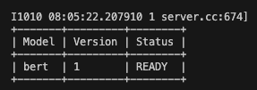

# Triton Inference Server Tutorial

## Docker 및 NVIDIA container toolkit 설치

- [INSTALL GUIDE NVIDIA CONTAINER TOOLKIT](https://docs.nvidia.com/datacenter/cloud-native/container-toolkit/latest/install-guide.html)

- Ubuntu에 Docker 설치

```
> sudo apt-get update

> sudo apt-get install apt-transport-https ca-certificates curl gnupg-agent software-properties-common

> curl -fsSL https://download.docker.com/linux/ubuntu/gpg | sudo apt-key add -

> sudo add-apt-repository "deb [arch=amd64] https://download.docker.com/linux/ubuntu $(lsb_release -cs) stable"

> sudo apt-get update

> sudo apt-get install docker-ce docker-ce-cli containerd.io
```

## 적절한 Triton container 버전 확인

- 현재 NVIDIA driver 버전에 알맞은 Triton container 버전 선택 [Triton 버전 리스트](https://docs.nvidia.com/deeplearning/triton-inference-server/release-notes/index.html)

- NVIDIA driver는 `nvidia-smi`으로 확인 가능

- Driver 버전이 535.xxx.xx이기 때문에 23.07로 이미지 빌드

```
docker pull nvcr.io/nvidia/tritonserver:23.08-py3
```

## 서빙할 모델 변환

- Triton은 Tensorflow, PyTorch, TensorRT, ONNX, OpenVINO 5가지 프레임워크를 지원하고 있음

- 기본적으로 PyTorch 모델을 Torchscript로 변환하여 사용하는 것으로 가정함
    - script 방식

    - trace 방식

- 변환 코드는 `convert_model.py`를 참고

## model_repository 구성

```
model_repository            
└── bert                    # model name
    ├── config.pbtxt        # configuration
    ├── 1                   # version (0은 무시)
    │   └── model.pt        # model file
    ├── 2                   
    └   └── model.pt        
```

- Triton Inference Server는 model_repository로 서빙할 모델을 다루고 있음.

- 모델 폴더 별로 config파일과 버전별로 변환 된 모델을 구성함으로 간단하게 서빙할 수 있음.

- 위의 예시는 PyTorch 모델(.pt)를 예시로 들었지만 ONNX, Tensorflow도 비슷한 구조로 구성.

### config.pbtxt 예시

- `,`하나로도 읽히지 않을 수 있으니 주의하여 작성

```text
name: "bert"
platform: "pytorch_libtorch"
max_batch_size: 32
input [
    {
        name: "input__0"
        data_type: TYPE_INT32
        dims: [256]
    },
    {
        name: "input__1"
        data_type: TYPE_INT32
        dims: [256]
    }
]
output {
    name: "output__0"
    data_type: TYPE_FP32
    dims: [2]
}
```

## Docker 실행

```
> docker run --rm --gpus=2 -p 8000:8000 -p 8001:8001 -p 8002:8002 -v /local/path/of/model:/models nvcr.io/nvidia/tritionserver:xx.yy-py3 tritonserver --model-repository=/models
```

<center>
    
</center>


## Triton client server

- Docker를 실행할 때, 3개의 port를 열었는데 각각 아래를 의미함
    - 8000 : http
    - 8001 : grpc
    - 8002 : metric

- `pip install tritonclient[all]`로 설치

- 예시 코드인 `triton_client.py`에서는 http 통신으로 실습

```
> python triton_client.py

"""
[[-0.18674763 -0.03257446]]
"""
```